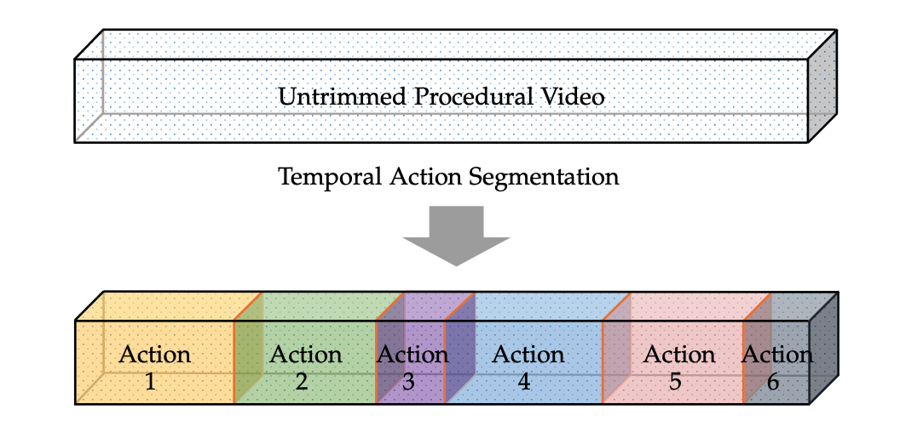

# Awesome Temporal Action Segmentation


A curated list of awesome temporal action segmentation resources. Inspired by [awesome-machine-learning-resources](https://github.com/ZhiningLiu1998/awesome-machine-learning-resources).
[](https://github.com/sindresorhus/awesome) 

⭐ **Please leave a <font color='orange'>STAR</font> if you like this project!** ⭐
## Table of Contents
- [The Task](#the-task)
- [Datasets](#Datasets)
  - [Breakfast Actions](#breakfast)
  - [GTEA](#GTEA)
  - [50Salads](#50salads)
  - [YouTube Instructional](#youtube-instructional)
  - [Assembly101](#assembly101) 
- [Evaluation](#evaluation-measures)
  - [Acc](#acc)
  - [F1](#f1-score)
  - [Edit](#edit-score) 
- [Core Techniques](#core-techniques)
  - [Frame Representation](#frame-represenations)
  - [Temporal Modeling](#temporal-modeling) 
  - [Sequential Modeling](#sequential-modeling)
- [Paper List](#paper-list)
  - [Fully-Supervised](#fully-supervised)
  - [Weakly-Supervised](#weakly-supervised)
  - [Unsupervsied](#unsupervised)
  - [Semi-Supervised](#semi-supervised)

## The Task
Temporal Action Segmentation takes as the input an untrimmed video sequence, segments it along the temporal dimension into clips and infers the semantics of actions in them.



## Surveys \& Overviews
- ATLAS tutorial in conjuction with ECCV2022. [[Tutorial]](https://atlas-eccv22.github.io) [[Talk]](placeholder)
- Temporal Action Segmentation: An Analysis of Modern Technique
  [[pdf]](https://arxiv.org/pdf/2210.10352.pdf) 
  - Guodong Ding, Fadime Sener, and Angela Yao

## Datasets
There are multiple datasets that have been used to benchmark the perfomance of the temporal action segmentation approaches. The most commonly adopted datasets are the as follows:

### Breakfast
- The Language of Actions: Recovering the Syntax and Semantics of Goal-Directed Human Activities 
  [[pdf]](https://openaccess.thecvf.com/content_cvpr_2014/papers/Kuehne_The_Language_of_2014_CVPR_paper.pdf) 
  - Hilde Kuehne, Ali Arslan, and Thomas Serre, *CVPR 2014*.

Breakfast Actions targets recording videos ''in the wild'', in 18 different kitchens, as opposed to the controlled lab environments in the previous datasets~\cite{fathi2011learning,stein2013combining}. The participants are not given any scrips and the recordings are unrehearsed and undirected. The dataset is composed of the 10 breakfast-related activities.  
This dataset is recorded with 52 participants with multiple cameras, varies from 3 to 5, all from a third-person point of view. There are 1712 videos, when accounting for the multi-camera views.

### GTEA
- Learning to Recognize Objects in Egocentric Activities 
  [[pdf]](https://arxiv.org/pdf/2102.08065.pdf) 
  - Alireza Fatih, Xiaofeng Ren, and M James Rehg, *CVPR 2011*.

contains 28 videos recorded in a single kitchen from seven procedural activities. 
The videos are recorded with a camera mounted on a cap, worn by four participants. 


### 50Salads

- Combining Embedded Accelerometers with Computer Vision for Recognizing Food Preparation Activities 
  [[pdf]](https://doi.org/10.1145/2493432.2493482) 
  - Sebastian Stein, and Stephen J Mckenna, *UbiComp 2013*.

is composed of 50 recorded videos of 25 participants making two different mixed salads. The videos are captured by a camera with a top-down view onto the work-surface. The participants are provided with recipe steps which are randomly sampled from a statistical recipe model.


### YouTube Instructional
- Unsupervised Learning from Narrated Instruction Videos 
  [[pdf]](https://doi.org/10.1109/CVPR.2016.495) 
  - Jean-Baptiste Alayrac, Piotr Bojanowski, Nishant Agrawal, Josef Sivic, Ivan Laptev, and Simon Lacoste-Julien, *CVPR 2016*.

is a recently collected dataset where 53 participants were asked to dissemble and assemble take apart toys without given any instructions which resulted in  realistic sequences with great variation in action ordering. The dataset is annotated with fine-grained, hand-object interactions, and coarse action labels which are composed of multiple fine-grained action segments related to the attaching or detaching of a vehicle part. The authors evaluated their dataset for temporal action segmentation using the coarse labels. 

### Assembly101
- Assembly101: A Large-Scale Multi-View Video Dataset for Understanding Procedural Activities 
  [[pdf]](https://openaccess.thecvf.com/content/CVPR2022/papers/Sener_Assembly101_A_Large-Scale_Multi-View_Video_Dataset_for_Understanding_Procedural_Activities_CVPR_2022_paper.pdf) 
  - Fadime Sener, Dibyadip Chatterjee, Daniel Shelepov, Kun He, Dipika Singhania, Robert Wang, and others, *CVPR 2022*.

is a recently collected dataset where 53 participants were asked to dissemble and assemble take apart toys without given any instructions which resulted in  realistic sequences with great variation in action ordering. The dataset is annotated with fine-grained, hand-object interactions, and coarse action labels which are composed of multiple fine-grained action segments related to the attaching or detaching of a vehicle part. The authors evaluated their dataset for temporal action segmentation using the coarse labels. 

## Evaluation Measures

### Acc
Accuracy or MoF (mean over frames) are an per-frame accuracy measure that calculates the ratio of frames that are correctly recognized by the temporal action model:

$\text{Acc}=\frac{\text{number of correct frames}}{\text{number of all frames}}$

### F1 score
The F1-score, or F1@$\tau$ compares the Intersection over Union (IoU) of each segment with respect to the corre- sponding ground truth based on some threshold $\tau/100$. $\tau$ are set to $\{10,25,50\}$. A segment is considered a true positive if its score with respect to the ground truth exceeds the threshold. If there is more than one correct segment within the span of a single ground truth action, then only one is marked as a true positive and the others are marked as false positives. 

$\text{F1} = 2 \cdot \frac{\text{precision}\times \text{recall}}{\text{precision} +\text{recall}}$.

### Edit score
The Edit Score is computed using the Levenshtein distance $e$, which quantifies how similar two sequences are to each other by counting the minimum number of operations required to convert one (segment) string into another. 

$\text{Edit} = \frac{1-e(X,Y)}{\text{max}(|X|,|Y|)} \cdot 100$

## Paper List
### Fully-Supervised
#### 2022
- Unified Fully and Timestamp Supervised Temporal Action Segmentation via Sequence to Sequence Translation,
  [[pdf]](https://arxiv.org/pdf/2209.00638.pdf)
    - Nadine Behrmann, S. Alireza Golestaneh, Zico Kolter, Juergen Gall, and Mehdi Noroozi, *ECCV 2022*.
#### 2021
- ASFormer: Transformer for Action Segmentation,
  [[pdf]](https://arxiv.org/pdf/2110.08568.pdf)
  [[code]](https://github.com/ChinaYi/ASFormer)
    - Fangqiu Yi, Hongyu Wen, and Tingting Jiang, *BMVC 2021*.
- Alleviating Over-segmentation Errors by Detecting Action Boundaries,
  [[pdf]](https://openaccess.thecvf.com/content/WACV2021/papers/Ishikawa_Alleviating_Over-Segmentation_Errors_by_Detecting_Action_Boundaries_WACV_2021_paper.pdf)
  [[code]](https://github.com/yiskw713/asrf)
    - Yuchi Ishikawa, Seito Kasai, Yoshimitsu Aoki, and Hirokatsu Kataoka, *WACV 2021*.
- Coarse to Fine Multi-Resolution Temporal Convolutional Network,
  [[pdf]](https://arxiv.org/pdf/2105.10859.pdf)
  [[code]](https://github.com/dipika-singhania/C2F-TCN)
    - Dipika Singhania, Rahul Rahaman, and Angela Yao, *Arxiv 2021*.
- FIFA: Fast Inference Approximation for Action Segmentation,
  [[pdf]](https://link.springer.com/chapter/10.1007/978-3-030-92659-5_18)
    - Yaser Souri, Yazan Abu Farha, Fabien Despinoy, Gianpiero Francesca, and Juergen Gall, *GCPR 2021*.
- Global2Local: Efficient Structure Search for Video Action Segmentation,
  [[pdf]](https://openaccess.thecvf.com/content/CVPR2021/papers/Gao_Global2Local_Efficient_Structure_Search_for_Video_Action_Segmentation_CVPR_2021_paper.pdf)
  [[code]](http://mmcheng.net/G2LSearch)
    - Shang-Hua Gao, Qi Han, Zhong-Yu Li, Pai Peng, Liang Wang, and Ming-Ming Cheng, *CVPR 2021*.
#### 2020
- Action Segmentation with Mixed Temporal Domain Adaptation,
  [[pdf]](https://openaccess.thecvf.com/content_WACV_2020/papers/Chen_Action_Segmentation_with_Mixed_Temporal_Domain_Adaptation_WACV_2020_paper.pdf)
    - Min-Hung Chen, Baopu Li, Yingze Bao, and Ghassan Alregib, *WACV 2020*.
- Boundary-Aware Cascade Networks for Temporal Action Segmentation,
  [[pdf]](https://www.ecva.net/papers/eccv_2020/papers_ECCV/papers/123700035.pdf)
  [[code]](https://github.com/MCG-NJU/BCN)
    - Zhenzhi Wang, Ziteng Gao, Limin Wang, Zhifeng Li, and Gangshan Wu, *ECCV 2020*.
- Improving Action Segmentation via Graph Based Temporal Reasoning,
  [[pdf]](https://openaccess.thecvf.com/content_CVPR_2020/papers/Huang_Improving_Action_Segmentation_via_Graph-Based_Temporal_Reasoning_CVPR_2020_paper.pdf)
    - Yifei Huang, Yusuke Sugano, and Yoichi Sato, *CVPR 2020*.
- Temporal Aggregate Representations for Long Term Video Understanding,
  [[pdf]](https://www.ecva.net/papers/eccv_2020/papers_ECCV/papers/123610154.pdf)
    - Fadime Sener, Dipika Singhania, and Angela Yao, *ECCV 2020*.
#### 2019
- MS-TCN: Multi-Stage Temporal Convolutional Network for Action Segmentation,
  [[pdf]](https://openaccess.thecvf.com/content_CVPR_2019/papers/Abu_Farha_MS-TCN_Multi-Stage_Temporal_Convolutional_Network_for_Action_Segmentation_CVPR_2019_paper.pdf)
  [[code]](https://github.com/yabufarha/ms-tcn)
    - Yazan Abu Farha, and Juergen Gall, *CVPR 2019*.
#### 2018
- Temporal Deformable Residual Networks for Action Segmentation in Videos,
  [[pdf]](https://ieeexplore.ieee.org/document/8578803)
    - Peng Lei, and Sinisa Todorovic, *CVPR 2018*.
#### 2017
- Quo Vadis, Action Recognition? A New Model and the Kinetics Dataset,
  [[pdf]](https://openaccess.thecvf.com/content_cvpr_2017/papers/Carreira_Quo_Vadis_Action_CVPR_2017_paper.pdf)
  [[code]](https://github.com/ahsaniqbal/Kinetics-FeatureExtractor)
    - João Carreira, and Andrew Zisserman, *CVPR 2017*.
- Temporal Convolutional Networks for Action Segmentation and Detection,
  [[pdf]](https://openaccess.thecvf.com/content_cvpr_2017/papers/Lea_Temporal_Convolutional_Networks_CVPR_2017_paper.pdf)
  [[code]](https://github.com/colincsl/TemporalConvolutionalNetworks)
    - Colin Lea, Michael D Flynn Ren, Austin Reiter, and Gregory D Hager, *CVPR 2017*.
#### 2016
- An end-to-end generative framework for video segmentation and recognition,
  [[pdf]](https://arxiv.org/pdf/1509.01947.pdf)
    - Hilde Kuehne, Juergen Gall, and Thomas Serre, *WACV 2016*.
- Temporal Action Detection Using a Statistical Language Model,
  [[pdf]](https://openaccess.thecvf.com/content_cvpr_2016/papers/Richard_Temporal_Action_Detection_CVPR_2016_paper.pdf)
  [[code]](https://github.com/alexanderrichard/squirrel)
    - Alexander Richard, and Juergen Gall, *CVPR 2016*.
### Weakly-Supervised
#### 2022
- A Generalized &amp; Robust Framework For Timestamp Supervision in Temporal Action Segmentation,
  [[pdf]](https://arxiv.org/pdf/2207.10137.pdf)
  [[code]](https://github.com/rahulrahaman/Timestamp-and-SkipTag)
    - Rahul Rahaman, Dipika Singhania, Alexandre Thiery, and Angela Yao, *ECCV 2022*.
- Hierarchical Modeling for Task Recognition and Action Segmentation in Weakly-Labeled Instructional Videos,
  [[pdf]](https://openaccess.thecvf.com/content/WACV2022/papers/Ghoddoosian_Hierarchical_Modeling_for_Task_Recognition_and_Action_Segmentation_in_Weakly-Labeled_WACV_2022_paper.pdf)
    - Reza Ghoddoosian, Saif Sayed, and Vassilis Athitsos, *WACV 2022*.
- Temporal Action Segmentation with High-level Complex Activity Labels,
  [[pdf]](https://arxiv.org/pdf/2108.06706.pdf)
    - Guodong Ding, and Angela Yao, *Arxiv 2022*.
- Unified Fully and Timestamp Supervised Temporal Action Segmentation via Sequence to Sequence Translation,
  [[pdf]](https://arxiv.org/pdf/2209.00638.pdf)
    - Nadine Behrmann, S. Alireza Golestaneh, Zico Kolter, Juergen Gall, and Mehdi Noroozi, *ECCV 2022*.
#### 2021
- Anchor-Constrained Viterbi for Set-Supervised Action Segmentation,
  [[pdf]](https://openaccess.thecvf.com/content/CVPR2021/papers/Li_Anchor-Constrained_Viterbi_for_Set-Supervised_Action_Segmentation_CVPR_2021_paper.pdf)
    - Jun Li, and Sinisa Todorovic, *CVPR 2021*.
- Learning Discriminative Prototypes with Dynamic Time Warping,
  [[pdf]](https://openaccess.thecvf.com/content/CVPR2021/papers/Chang_Learning_Discriminative_Prototypes_With_Dynamic_Time_Warping_CVPR_2021_paper.pdf)
    - Xiaobin Chang, Frederick Tung, and Greg Mori, *CVPR 2021*.
- Temporal Action Segmentation from Timestamp Supervision,
  [[pdf]](https://openaccess.thecvf.com/content/CVPR2021/papers/Li_Temporal_Action_Segmentation_From_Timestamp_Supervision_CVPR_2021_paper.pdf)
  [[code]](https://github.com/ZheLi2020/TimestampActionSeg)
    - Zhe Li, Yazan Abu Farha, and Juergen Gall, *CVPR 2021*.
#### 2020
- Fast Weakly Supervised Action Segmentation Using Mutual Consistency,
  [[pdf]](https://arxiv.org/pdf/1904.03116.pdf)
    - Yaser Souri, Mohsen Fayyaz, Luca Minciullo, Gianpiero Francesca, and Juergen Gall, *ECCV 2020*.
- Procedure Completion by Learning from Partial Summaries,
  [[pdf]](https://www.bmvc2020-conference.com/assets/papers/0130.pdf)
    - Zwe Naing, and Ehsan Elhamifar, *BMVC 2020*.
- SCT: Set Constrained Temporal Transformer for Set Supervised Action Segmentation,
  [[pdf]](https://openaccess.thecvf.com/content_CVPR_2020/papers/Fayyaz_SCT_Set_Constrained_Temporal_Transformer_for_Set_Supervised_Action_Segmentation_CVPR_2020_paper.pdf)
  [[code]](https://github.com/MohsenFayyaz89/SCT)
    - Mohsen Fayyaz, and Juergen Gall, *CVPR 2020*.
- Set-Constrained Viterbi for Set-Supervised Action Segmentation,
  [[pdf]](https://openaccess.thecvf.com/content_CVPR_2020/papers/Li_Set-Constrained_Viterbi_for_Set-Supervised_Action_Segmentation_CVPR_2020_paper.pdf)
    - Jun Li, and Sinisa Todorovic, *CVPR 2020*.
#### 2019
- D3TW: Discriminative differentiable dynamic time warping for weakly supervised action alignment and segmentation,
  [[pdf]](https://openaccess.thecvf.com/content_CVPR_2019/papers/Chang_D3TW_Discriminative_Differentiable_Dynamic_Time_Warping_for_Weakly_Supervised_Action_CVPR_2019_paper.pdf)
  [[code]](https://github.com/ld-ing/TCFPN-ISBA)
    - Chien Yi Chang, De An Huang, Yanan Sui, Fei-Fei Li, and Juan Carlos Niebles, *CVPR 2019*.
- Weakly Supervised Energy-Based Learning for Action Segmentation,
  [[pdf]](https://openaccess.thecvf.com/content_ICCV_2019/papers/Li_Weakly_Supervised_Energy-Based_Learning_for_Action_Segmentation_ICCV_2019_paper.pdf)
  [[code]](https://github.com/JunLi-Galios/CDFL)
    - Jun Li, Peng Lei, and Sinisa Todorovic, *ICCV 2019*.
#### 2018
- A Hybrid RNN-HMM Approach for Weakly Supervised Temporal Action Segmentation,
  [[pdf]](https://arxiv.org/pdf/1906.01028.pdf)
    - Hilde Kuehne, Alexander Richard, and Juergen Gall, *TPAMI 2018*.
- Action Sets: Weakly Supervised Action Segmentation Without Ordering Constraints,
  [[pdf]](https://alexanderrichard.github.io/publications/pdf/richard_action_sets.pdf)
  [[code]](https://github.com/alexanderrichard/action-sets)
    - Alexander Richard, Hilde Kuehne, and Juergen Gall, *CVPR 2018*.
- NeuralNetwork-Viterbi: A Framework for Weakly Supervised Video Learning,
  [[pdf]](https://openaccess.thecvf.com/content_cvpr_2018/papers/Richard_NeuralNetwork-Viterbi_A_Framework_CVPR_2018_paper.pdf)
  [[code]](https://github.com/alexanderrichard/NeuralNetwork-Viterbi)
    - Alexander Richard, Hilde Kuehne, Ahsan Iqbal, and Juergen Gall, *CVPR 2018*.
- Weakly-Supervised Action Segmentation with Iterative Soft Boundary Assignment,
  [[pdf]](https://openaccess.thecvf.com/content_cvpr_2018/CameraReady/1522.pdf)
  [[code]](https://github.com/ld-ing/TCFPN-ISBA)
    - Li Ding, and Chenliang Xu, *CVPR 2018*.
#### 2017
- Weakly supervised action learning with RNN based fine-to-coarse modeling,
  [[pdf]](https://openaccess.thecvf.com/content_cvpr_2017/papers/Richard_Weakly_Supervised_Action_CVPR_2017_paper.pdf)
  [[code]](https://github.com/alexanderrichard/weakly-sup-action-learning)
    - Alexander Richard, Hilde Kuehne, and Juergen Gall, *CVPR 2017*.
- Weakly supervised learning of actions from transcripts,
  [[pdf]](https://arxiv.org/pdf/1610.02237.pdf)
    - Hilde Kuehne, Alexander Richard, and Juergen Gall, *CVIU 2017*.
#### 2016
- Connectionist temporal modeling for weakly supervised action labeling,
  [[pdf]](https://arxiv.org/pdf/1607.08584.pdf)
  [[code]](https://github.com/daahuang/lasagne-ectc)
    - De An Huang, Fei-Fei Li, and Juan Carlos Niebles, *ECCV 2016*.
### Unsupervised
#### 2022
- Fast and Unsupervised Action Boundary Detection for Action Segmentation,
  [[pdf]](https://openaccess.thecvf.com/content/CVPR2022/papers/Du_Fast_and_Unsupervised_Action_Boundary_Detection_for_Action_Segmentation_CVPR_2022_paper.pdf)
    - Zexing Du, Xue Wang, Guoqing Zhou, and Qing Wang, *CVPR 2022*.
#### 2021
- Action Shuffle Alternating Learning for Unsupervised Action Segmentation,
  [[pdf]](https://openaccess.thecvf.com/content/CVPR2021/papers/Li_Action_Shuffle_Alternating_Learning_for_Unsupervised_Action_Segmentation_CVPR_2021_paper.pdf)
    - Jun Li, and Sinisa Todorovic, *CVPR 2021*.
- Joint Visual-Temporal Embedding for Unsupervised Learning of Actions in Untrimmed Sequences,
  [[pdf]](https://openaccess.thecvf.com/content/WACV2021/papers/VidalMata_Joint_Visual-Temporal_Embedding_for_Unsupervised_Learning_of_Actions_in_Untrimmed_WACV_2021_paper.pdf)
    - Rosaura G Vidalmata, Walter J Scheirer, Anna Kukleva, David Cox, and Hilde Kuehne, *WACV 2021*.
- Temporally-Weighted Hierarchical Clustering for Unsupervised Action Segmentation,
  [[pdf]](https://openaccess.thecvf.com/content/CVPR2021/papers/Sarfraz_Temporally-Weighted_Hierarchical_Clustering_for_Unsupervised_Action_Segmentation_CVPR_2021_paper.pdf)
  [[code]](https://github.com/ssarfraz/FINCH-Clustering/tree/master/TW-FINCH)
    - M Saquib Sarfraz, Naila Murray, Vivek Sharma, Ali Diba, Luc Van Gool, and Rainer Stiefelhagen, *CVPR 2021*.
#### 2020
- Action Segmentation with Joint Self-Supervised Temporal Domain Adaptation,
  [[pdf]](https://openaccess.thecvf.com/content_CVPR_2020/papers/Chen_Action_Segmentation_With_Joint_Self-Supervised_Temporal_Domain_Adaptation_CVPR_2020_paper.pdf)
  [[code]](https://github.com/cmhungsteve/SSTDA)
    - Min-Hung Chen, Baopu Li, Yingze Bao, Ghassan AlRegib, and Zsolt Kira, *CVPR 2020*.
#### 2019
- Unsupervised learning of action classes with continuous temporal embedding,
  [[pdf]](https://arxiv.org/pdf/1904.04189.pdf)
  [[code]](https://github.com/annusha/unsup_temp_embed)
    - Anna Kukleva, Hilde Kuehne, Fadime Sener, and Jurgen Gall, *CVPR 2019*.
- Unsupervised procedure learning via joint dynamic summarization,
  [[pdf]](https://openaccess.thecvf.com/content_ICCV_2019/papers/Elhamifar_Unsupervised_Procedure_Learning_via_Joint_Dynamic_Summarization_ICCV_2019_paper.pdf)
    - Ehsan Elhamifar, and Zwe Naing, *ICCV 2019*.
#### 2018
- Unsupervised Learning and Segmentation of Complex Activities from Video,
  [[pdf]](https://openaccess.thecvf.com/content_cvpr_2018/papers/Sener_Unsupervised_Learning_and_CVPR_2018_paper.pdf)
  [[code]](https://github.com/Annusha/slim_mallow)
    - Fadime Sener, and Angela Yao, *CVPR 2018*.
#### 2016
- Unsupervised learning from narrated instruction videos,
  [[pdf]](https://www.cv-foundation.org/openaccess/content_cvpr_2016/papers/Alayrac_Unsupervised_Learning_From_CVPR_2016_paper.pdf)
    - Jean-Baptiste Alayrac, Piotr Bojanowski, Nishant Agrawal, Josef Sivic, Ivan Laptev, and Simon Lacoste-Julien, *CVPR 2016*.
#### 2015
- Unsupervised Semantic Parsing of Video Collections,
  [[pdf]](https://openaccess.thecvf.com/content_iccv_2015/papers/Sener_Unsupervised_Semantic_Parsing_ICCV_2015_paper.pdf)
    - Ozan Sener, Amir R. Zamir, Silvio Savarese, and Ashutosh Saxena, *ICCV 2015*.
### Semi-Supervised
#### 2022
- Iterative Contrast-Classify for Semi-supervised Temporal Action Segmentation,
  [[pdf]](https://ojs.aaai.org/index.php/AAAI/article/view/20124/19883)
  [[code]](https://github.com/dipika-singhania/ICC-Semi-Supervised-TAS)
    - Dipika Singhania, Rahul Rahaman, and Angela Yao, *AAAI 2022*.
- Leveraging Action Affinity and Continuity for Semi-supervised Temporal Action Segmentation,
  [[pdf]](https://arxiv.org/pdf/2207.08653.pdf)
  [[code]](https://github.com/dinggd/semitas)
    - Guodong Ding, and Angela Yao, *ECCV 2022*.


## Citation
If you find this repository helpful in your research, please consider citing our survey as:
```
@article{ding2022temporal,
    title={Temporal Action Segmentation: An Analysis of Modern Technique},
    author={Ding, Guodong and Sener, Fadime and Yao, Angela},
    journal={arXiv preprint arXiv:2210.10352},
    year={2022}
}
```

## Feedback
- [pull request](https://github.com/atlas-eccv22/awesome-temporal-action-segmentation/pulls)